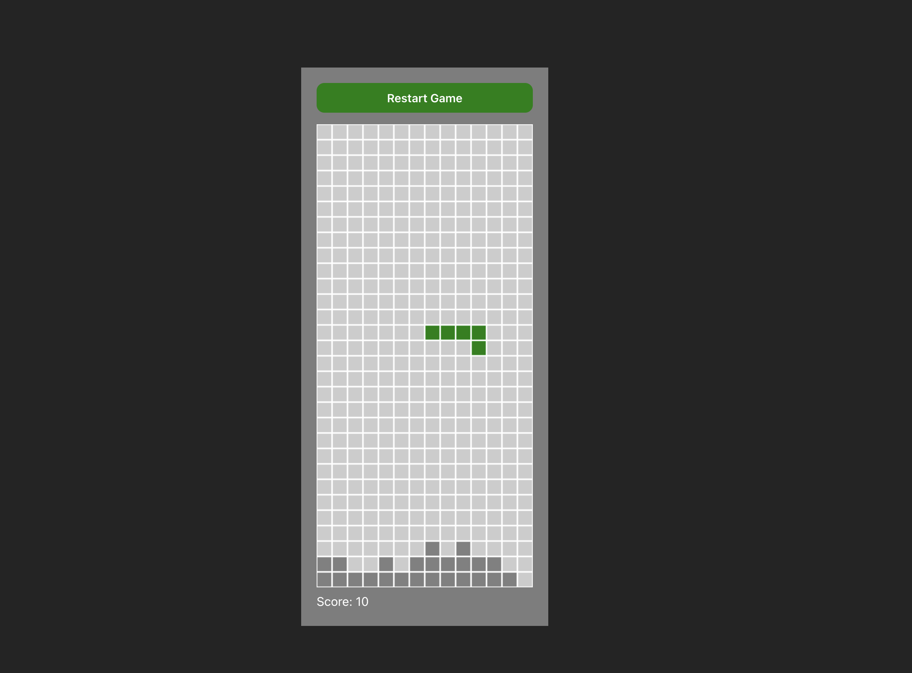

# 🎮 Tetris Game

Un clon del clásico juego **Tetris**, desarrollado con **TypeScript**, **Vite** y **CSS** puro. Este proyecto es una implementación sencilla y funcional que demuestra conocimientos de lógica de juegos, manipulación del DOM y control del flujo de piezas en tiempo real.

## 🧱 Características

- Lógica completa del juego Tetris
- Interfaz limpia con CSS
- Velocidad de caída progresiva
- Controles con teclado:
  - ⬅️ Mover a la izquierda
  - ➡️ Mover a la derecha
  - ⬇️ Acelerar caída
  - ⬆️ Rotar pieza
- Game over y reinicio

## 🚀 Tecnologías

- [TypeScript](https://www.typescriptlang.org/)
- [Vite](https://vitejs.dev/)
- [CSS3](https://developer.mozilla.org/en-US/docs/Web/CSS)

## 📦 Instalación

1. Clona el repositorio:

   ```bash
   git clone https://github.com/maxiprys/tetris.git
   cd tetris
   ```

2. Instala las dependencias:

   ```bash
   npm install
   ```

3. Inicia el servidor de desarrollo:

   ```bash
   npm run dev
   ```

4. Abre tu navegador en `http://localhost:5173` para jugar.

## 🛠️ Scripts disponibles

- `npm run dev` – Inicia el servidor de desarrollo
- `npm run build` – Compila la app para producción
- `npm run preview` – Sirve la app en modo producción local

## 📁 Estructura del proyecto

\`\`\`
tetris/
├── public/
├── src/
│ ├── consts.ts
│ ├── main.ts
│ └── style.css
├── index.html
├── vite.config.js
└── README.md
\`\`\`

## 📸 Captura



## 🧪 Posibles mejoras

- Sistema de puntuación
- Guardado de récords en LocalStorage
- Sonidos y música
- Modo de niveles progresivos

## 📄 Licencia

Este proyecto está licenciado bajo la [MIT License](LICENSE).

---

¡Disfruta del juego y diviértete programando!
